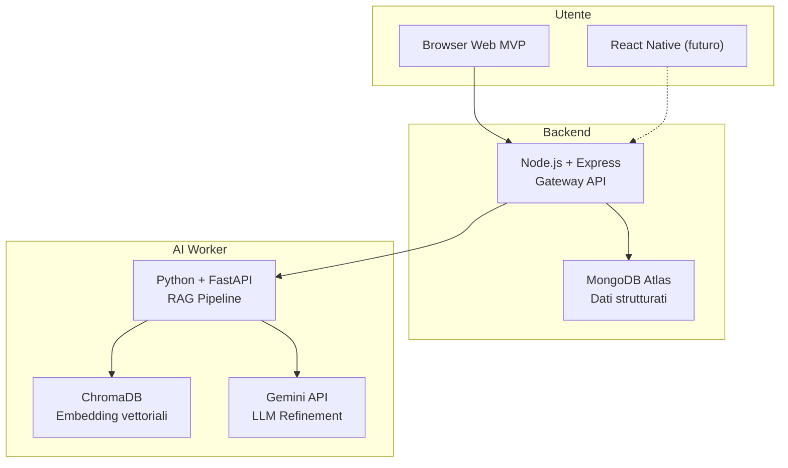
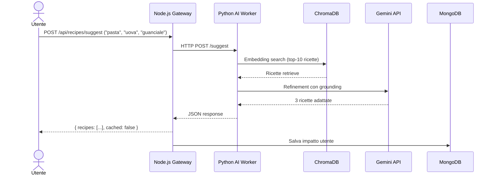

<!-- markdownlint-disable MD041 MD033 -->
<div align="center">

# 🧊 FridgeSavvy → Food Coach

### Imparare l'ingegneria del software costruendo un'app contro lo spreco alimentare.

[](LICENSE)
[]()

</div>

---

## Cos'è FridgeSavvy?

FridgeSavvy sono due cose, e vale la pena distinguerle.

**Food Coach** è un'app che prova ad affrontare lo spreco alimentare in modo diverso. Invece di darti solo ricette con gli avanzi (che è quello che fanno tutte), cerca di insegnarti a sprecare meno a monte: come fare la spesa, come conservare, come cucinare quello che hai. La filosofia è un po' anticommerciale: se l'app funziona bene, col tempo non ne avrai più bisogno. È una delle ragioni per cui ho voluto costruirla.

**Un percorso di apprendimento.** Ogni pezzo di questo progetto è aperto, codice, decisioni, errori. Lo sto costruendo mentre imparo, seguendo un ciclo SDLC vero, dalla teoria al deploy. Serve a chiunque voglia vedere come si passa da un'idea a un prodotto senza saltare i passaggi.

---

## Obiettivo

Insegnare a sprecare meno cibo. Non attraverso un tracciatore o una lista della spesa obbligatoria, ma provando a cambiare il modo in cui le persone pensano al cibo che comprano e cucinano.

L'app fa tre cose:
- Ricevi 3 ricette adattate agli ingredienti che hai, senza liste infinite
- Traccia l'impatto: quanti pasti hai salvato, quanti soldi.
- Piano: aggiungere pianificazione settimanale, conservazione, challenge (ma prima deve funzionare la parte base)

---

## Stack tecnologico

| Layer | Tecnologia | Perché |
|---|---|---|
| **Gateway** | Node.js + Express | API REST, orchestrazione |
| **AI Worker** | Python + FastAPI | Recommendation engine RAG |
| **Database** | MongoDB Atlas | Dati strutturati |
| **Vector DB** | ChromaDB | Embedding per similarity search |
| **LLM** | Gemini API (free tier) | Refinement ricette |
| **Frontend (futuro)** | React Native | Cross-platform mobile |

### Architettura



La pipeline e' semplice: embedding search su ChromaDB recupera le ricette piu' vicine, Gemini le adatta agli ingredienti che hai. Niente fine-tuning, niente modelli custom.

Se nessuna ricetta matcha, il sistema prova con una combinazione nuova. Se ancora non basta, chiede all'utente: "Hai anche un uovo? Con quello potrei fare..."

### Flusso richiesta



## Struttura del Corso (SDLC)

Il progetto segue le 6 fasi del Software Development Life Cycle usate in azienda:

```
📘 Cap. 00 — Fondamenti Teorici    ✅ (Agile/Scrum, metodologie)
📗 Cap. 01 — Idea e Requisiti      ✅ (Feature analysis, brainstorming)
📙 Cap. 02 — System Design         ✅ (Architettura, microservizi)
📕 Cap. 03 — Detailed Design       ✅ (Data modeling, API design) ← COMPLETATO
📓 Cap. 04 — Sviluppo e Codice     🔄 (Sprint 1 — Dataset + Backend)
📔 Cap. 05 — Testing e Qualità     ⏳
📒 Cap. 06 — Deploy e CI/CD        ⏳
```

Ogni capitolo contiene documenti teorici, esercizi e risorse YouTube per studiare in autonomia prima di scrivere codice.

Vedi l'[Indice Completo del Corso](docs/Indice_Corso_Software_Engineering.md) e il [Design Doc Food Coach](docs/03_Detailed_Design_e_Modellazione/Food_Coach_Design_Doc.md).

---

## Stato Attuale

Il progetto è in **Fase 4 (Sviluppo)**. Fase 3 (Detailed Design) è completata.

- [x] Fondamenti teorici (Agile, Scrum, ruoli)
- [x] Idea validata e requisiti definiti
- [x] Architettura a microservizi progettata
- [x] Tech stack scelto e motivato
- [x] Data modeling NoSQL
- [x] API Design REST
- [x] Design doc revisionato (/plan-eng-review)
- [ ] Sprint 1 — Dataset ricette + setup monorepo
- [ ] Sprint 2 — AI Core (embedding + RAG pipeline)
- [ ] Sprint 3 — Backend API (Node.js gateway)

---

## Obiettivi di Apprendimento

Cosa sto imparando costruendo Food Coach:

- ✅ System Design e architetture a microservizi
- ✅ API REST con Node.js + Express
- ✅ Database NoSQL (MongoDB) e modellazione dati
- ✅ RAG pipeline (embedding search + LLM refinement)
- ✅ Database vettoriali (ChromaDB)
- ✅ AI integration (Gemini API, sentence-transformers)
- ✅ Python + FastAPI per microservizi AI
- ✅ DevOps: CI/CD, Docker, deploy cloud
- ✅ Frontend mobile cross-platform (React Native, futuro)
- ✅ Git branch strategy e code review

---

## Licenza

Distribuito sotto licenza MIT. Vedi il file [LICENSE](LICENSE) per maggiori informazioni.

---

