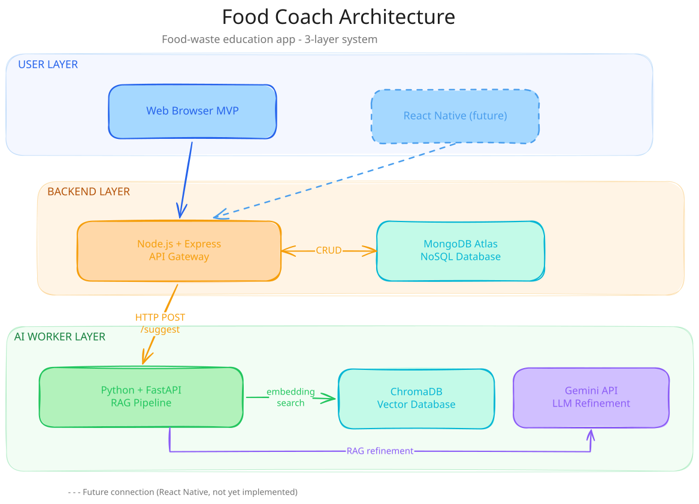

<!-- markdownlint-disable MD041 MD033 -->

# 🧊 Project Food Coach

### Learning software engineering by building an app against food waste.

---

## What is Project Food Coach?

Project Food Coach is two things, and they are not the same.

**Food Coach** is an app that tries to tackle food waste differently. Instead of just giving you recipes for leftovers (which is what they all do), it tries to teach you how to waste less upstream: how to shop, how to store, how to cook what you have. The philosophy is a bit anti-commercial: if it works well, over time you won't need it anymore. That is one of the reasons I wanted to build it.

**A learning path.** Every piece of this project is open. The code, the decisions, the mistakes. I am building it while I learn, following a real SDLC cycle from theory to deploy.

---

## Goal

Teach people to waste less food. Not with a tracker or a mandatory shopping list, but by trying to change how people think about the food they buy and cook.

The app does three things:
- Get 3 recipes adapted to the ingredients you have. No endless lists.
- Track impact: meals saved, money saved.
- Plan: weekly planning, storage tips, challenges down the line. The basics need to work first.

---

## Tech Stack

| Layer | Technology | Why |
|---|---|---|
| **Gateway** | Node.js + Express | API REST, orchestration |
| **AI Worker** | Python + FastAPI | RAG recommendation engine |
| **Database** | MongoDB Atlas | Structured data |
| **Vector DB** | ChromaDB | Embeddings for similarity search |
| **LLM** | Gemini API (MVP) | Recipe refinement |
| **Frontend (future)** | React Native | Cross-platform mobile |

### Architecture

The pipeline is simple: embedding search on ChromaDB finds the closest recipes, the LLM adapts them to your ingredients. No fine-tuning, no custom models.

If no recipe matches, the system tries a new combination. If that still falls short, it asks: "Do you also have an egg? With that I could make..."

### Request Flow

---

## Learning Goals

What I plan to learn by building Food Coach:

- System design and microservices architecture
- REST APIs with Node.js + Express
- NoSQL databases (MongoDB) and data modeling
- RAG pipeline (embedding search + LLM refinement)
- Vector databases (ChromaDB)
- AI integration (Gemini API, sentence-transformers)
- Python + FastAPI for AI microservices
- DevOps: CI/CD, Docker, cloud deploy
- Cross-platform mobile frontend (React Native, future)
- Git branch strategy and code review

---

## License

MIT License. See [LICENSE](LICENSE) for more information.

---

