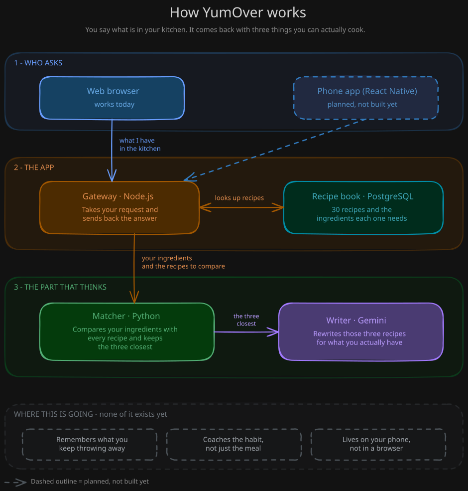
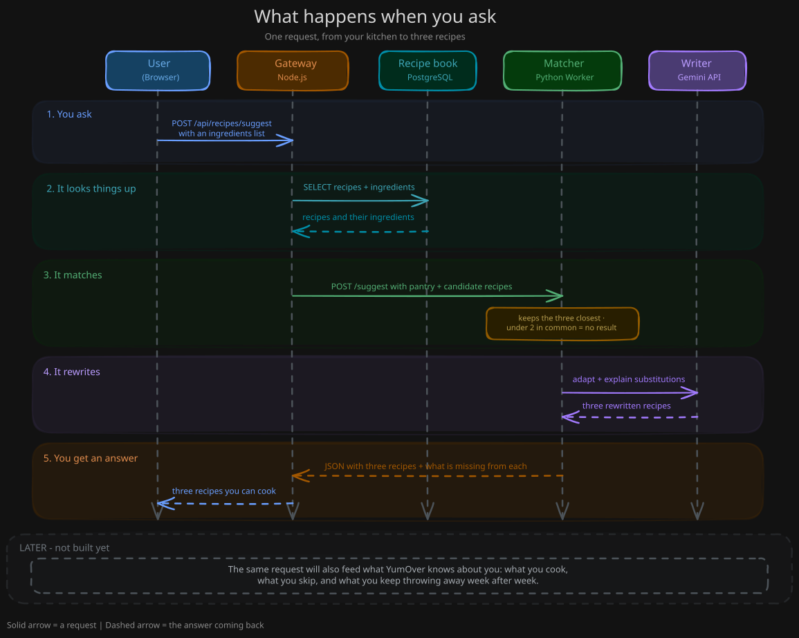

<!-- markdownlint-disable MD041 MD033 -->

### Learning software engineering by building an app against food waste.

---

## What is YumOver?

YumOver is two things, and they are not the same.

**YumOver** is an app that tries to tackle food waste differently. Instead of just giving you recipes for leftovers (which is what they all do), it tries to teach you how to waste less upstream: how to shop, how to store, how to cook what you have. The philosophy is a bit anti-commercial: if it works well, over time you won't need it anymore. That is one of the reasons I wanted to build it.

**A learning path.** Every piece of this project is open. The code, the decisions, the mistakes. I am building it while I learn, following a real SDLC cycle from theory to deploy.

---

## Goal

Teach people to waste less food. Not with a tracker or a mandatory shopping list, but by trying to change how people think about the food they buy and cook.

The app does three things:
- Get 3 recipes adapted to the ingredients you have. No endless lists.
- Learn something every time: storage tips, substitutions, techniques — built into every suggestion.
- Track impact: meals saved, money saved.

The coaching grows with you. Starts with simple tips, then adapts as it learns your patterns. You decide how much help you want.

---

## Tech Stack

| Layer | Technology | Why |
|---|---|---|
| **Gateway** | Node.js + Express | API REST, orchestration |
| **AI Worker** | Python + FastAPI | RAG recommendation engine |
| **Database** | PostgreSQL | Relational core for recipes/ingredients, with room to grow (JSONB, pgvector) without switching engines later |
| **Recipe retrieval** | Deterministic overlap (Jaccard, k=3) | Measured against embedding search on real data — overlap won on every metric, three orders of magnitude faster ([#25](https://github.com/H-Alin02/YumOver/issues/25)) |
| **LLM** | Gemini API (MVP) | Adapts the retrieved recipe and explains substitutions |
| **Frontend (future)** | React Native | Cross-platform mobile |

### Architecture

Three parts. The **gateway** takes your request and it pulls the recipes out of the database and hands them over. The **matcher** compares
your ingredients against every recipe it was given and keeps the three closest: under
two ingredients in common it returns nothing at all, rather than the least bad guess.
Then **Gemini rewrites** those three for what you actually have and explains the swaps.
It never picks the recipes, so the three you see are the matcher's three.

  

### What happens when you ask

One request, start to finish.

  

---

## Roadmap

### Towards MVP

- Pick what you have from a list of ingredients (based on available recipes)
- Get three recipes you can actually cook
- Swap out an ingredient you don't have, when it's swappable
- Use up what's about to go bad first
- Exclude what you're allergic to, deterministically

### Post-MVP

- A companion that remembers your patterns over time, not just recipes
- Cross-platform mobile app (React Native)
- Practical techniques for using up what you can't cook right away, not just more recipes

---

## Learning Goals

What I plan to learn by building YumOver:

- System design and microservices architecture
- REST APIs with Node.js + Express
- Relational databases (PostgreSQL) and data modeling
- RAG pipeline (retrieval + LLM refinement)
- Retrieval strategies: deterministic matching vs. embeddings
- AI integration (Gemini API)
- Python + FastAPI for AI microservices
- DevOps: CI/CD, Docker, cloud deploy
- Cross-platform mobile frontend (React Native, future)
- Git branch strategy and code review

---

## License

MIT License. See [LICENSE](LICENSE) for more information.

---

